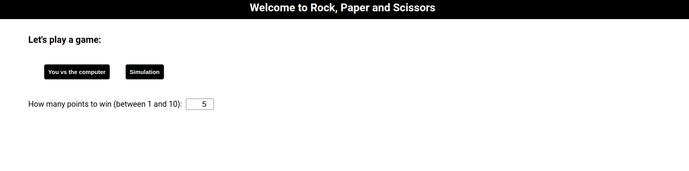
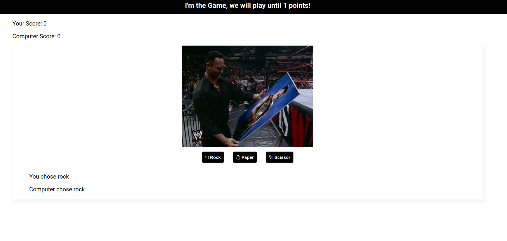
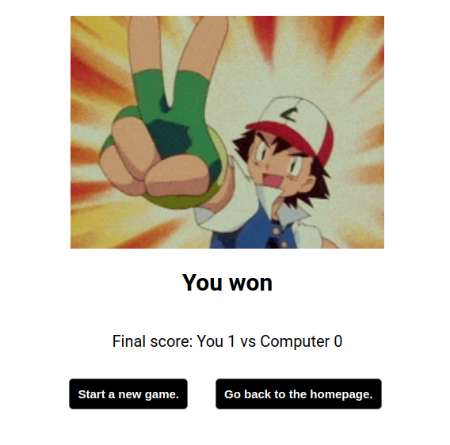

# Rock, Paper and Scissors

> A web app to play rock, paper and scissors vs the computer or to simulate a game. 

## Implemented Features

* Possibility to choose between a game vs the computer or to simulate it.
* From 1 to 10 rounds limit. 
* 9 different gifs to cover all the different combinations plus two differents one that will play if you win or lose. 

## Screenshot

**Homepage**

**Game**

**Victory!**

## Usage

* Clone this repo in your local environment using `git clone`.

* Go to the folder.

* `npm install` to begin dependencies installation.

* `npm start` to run it.

* `npm test` to run the react tests.

## Built with

* [React](https://reactjs.org/) - Front end library for building user interfaces.
* [React-testing-library](https://testing-library.com/) - React testing utilities.

## Improvements

* The tests can be improved with test ids to not cause problems if the text will change in a future version.
* Not mobile-ready yet, possible to implement media queries or a css fw to cover it.
* Game component can be split into extra sub-components to be more in line with the React philosophy.

## Extra thoughts

* The tracking of the points/rounds and the simulation is done via the url and the different parameters. In a bigger project or in a future version, it is possible to follow a different path (as using Redux or React-context).

## Authors

* Pier Andrea Delise: [GitHub](https://github.com/pierandread) - [LinkedIn](https://www.linkedin.com/in/pier-andrea-delise/)
